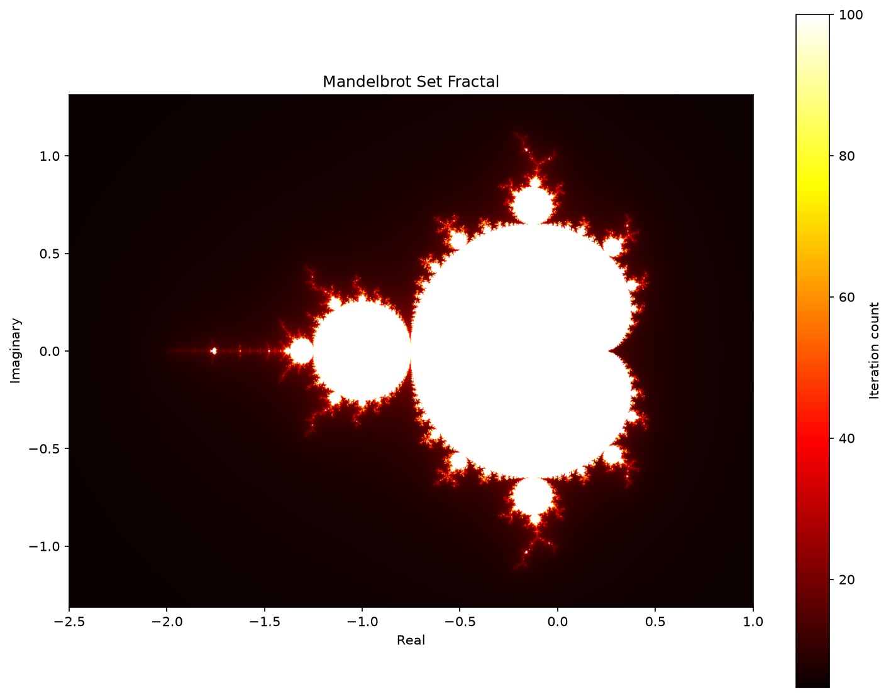
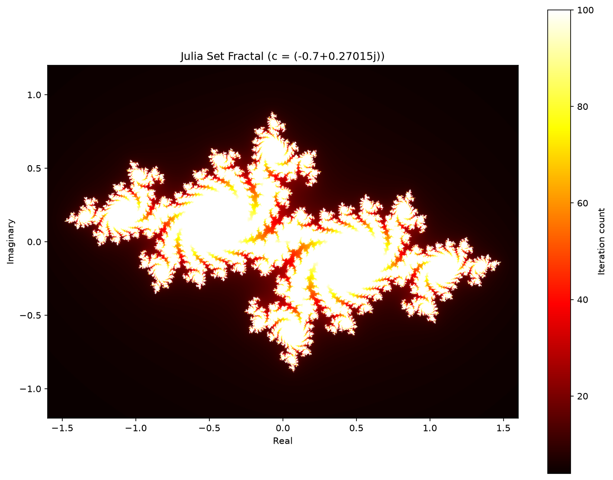

# Advanced Fractal Generator

Generates and visualizes the Mandelbrot and Julia sets using vectorized NumPy escape-time iteration and Matplotlib.




## Features

- **Mandelbrot and Julia sets**, with any Julia constant `c`
- **Vectorized NumPy computation**: only the points that have not escaped yet are iterated
- **Smooth colouring**: fractional iteration counts remove colour banding (use `--no-smooth` to turn it off)
- **Square pixels**: the imaginary range follows the image aspect ratio
- **Zoom animation**: renders a numbered sequence of frames zooming into the Mandelbrot boundary
- **Command-line interface**: set the size, iteration count, colormap and output directory

## Mathematical Background

### Mandelbrot Set
The Mandelbrot set is the set of complex numbers `c` for which `z → z² + c` does not diverge when iterated from `z = 0`.

### Julia Set
For a fixed complex constant `c`, the Julia set is the set of starting points `z` for which the same iteration `z → z² + c` does not diverge.

Each pixel is coloured by how many iterations it takes to escape. With smooth colouring the count is `n + 1 - log₂(log|z| / log R)`, where `R` is the bailout radius.

## Requirements

- Python 3.8+
- NumPy
- Matplotlib

## Installation

```bash
pip install -r requirements.txt
```

## Usage

```bash
python fractal_generator.py
```

This writes `mandelbrot_fractal.png` and `julia_fractal.png` to the current directory. Useful options:

```bash
python fractal_generator.py --width 1920 --height 1080 --max-iter 300
python fractal_generator.py --julia-c=-0.8+0.156j --colormap magma
python fractal_generator.py --output-dir out --animate 20   # also render 20 zoom frames
python fractal_generator.py --show                          # open interactive windows
```

Run `python fractal_generator.py --help` for all options.

### As a library

```python
from fractal_generator import FractalGenerator

gen = FractalGenerator(width=800, height=600, max_iter=200)
data = gen.generate_mandelbrot(center=-0.745 + 0.113j, span=0.05)
gen.visualize_fractal(data, gen.bounds(-0.745 + 0.113j, 0.05), output="zoom.png")
```

## Tests

```bash
pip install pytest
pytest
```

## Code Structure

- `fractal_generator.py`: the `FractalGenerator` class and the command-line entry point
- `test_fractal_generator.py`: pytest test suite
- `requirements.txt`: runtime dependencies
